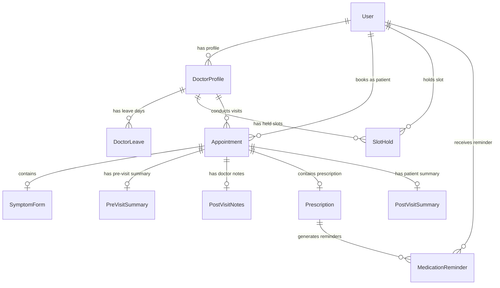

# Healthcare Appointment & Follow-up Manager

A complete, production-quality **Healthcare Appointment & Follow-up Manager** web application featuring role-based portals for Patients, Doctors, and System Admins. The platform provides real-time slot booking with short-lived slot holds, atomic double-booking prevention, LLM-powered pre-visit symptom analysis and post-visit patient summaries with graceful fallback safety, automated medication reminder schedules, doctor leave conflict resolution, and email/Google Calendar sync.

---

## 🌐 Live Hosted Application & Deployment URLs

- **GitHub Repository**: [https://github.com/Anubhav7070/HealthCare_Unthinkable](https://github.com/Anubhav7070/HealthCare_Unthinkable)
- **Live Public URL**: [https://healthcareappointment.loca.lt](https://healthcareappointment.loca.lt)
- **Local Application App**: `http://localhost:3000`
- **Local Backend API**: `http://localhost:5000`

---

## 🌟 Features Overview

- **Multi-Role Portals**: Dedicated UI views and permissions for **Patient**, **Doctor**, and **Admin**.
- **Real-Time Slot Engine**: Slots are dynamically generated from working hours minus leave days, booked slots, and active unexpired slot holds.
- **Concurrency & Double-Booking Prevention**: PostgreSQL/SQLite level unique constraint `@@unique([doctorId, slotStartTime])` combined with atomic transactions to prevent double-booking under simultaneous requests.
- **Short-Lived Slot Holds**: 3-minute TTL slot holds when a patient starts symptom form checkout, preventing slot hijacking.
- **LLM Pre-Visit Analysis**: Generates urgency badges (High, Medium, Low), chief complaints, and suggested doctor questions before each consultation.
- **LLM Post-Visit Care Summaries**: Converts clinical notes & prescriptions into patient-friendly summaries with dose schedules and follow-up steps.
- **LLM Failure Resilience**: Automatic retry with exponential backoff, timeout protection, and seamless fallback to raw notes so care is never blocked.
- **Doctor Leave Management**: Automated conflict detection on leave creation, notifying affected patients by email with cancellation/reschedule instructions and alternate slot suggestions.
- **Medication Reminders**: Parses prescription dose frequencies (e.g., "twice daily for 7 days") and schedules automated reminder emails.
- **Google Calendar Sync**: Integrates OAuth 2.0 to create, update, and delete calendar events without blocking DB transactions.

---

## 🚀 Quickstart Guide

### Prerequisites
- Node.js (v18+)
- npm (v9+)

### Installation & Setup

1. **Install All Dependencies**:
   ```bash
   npm run setup
   ```

2. **Generate Database Schema & Seed Data**:
   ```bash
   npm run db:generate
   npm run db:push
   npm run db:seed
   ```

3. **Start Development Servers (Backend + Frontend)**:
   - In terminal 1 (Backend API on http://localhost:5000):
     ```bash
     npm run dev:backend
     ```
   - In terminal 2 (Frontend App on http://localhost:3000):
     ```bash
     npm run dev:frontend
     ```

4. **Default Seeded Accounts**:
   - **Admin**: `admin@healthcare.org` / `password123`
   - **Doctor**: `dr.smith@healthcare.org` / `password123`
   - **Patient**: `patient@example.com` / `password123`

---

## 🧬 Database Schema & ER Diagram



---

## 🔌 API Documentation

### Auth Endpoints
- `POST /api/auth/register` - Register a new user (`name`, `email`, `password`, `role`).
- `POST /api/auth/login` - Authenticate user and receive JWT.
- `GET /api/auth/me` - Get current authenticated user details.

### Patient Endpoints
- `GET /api/patient/doctors` - Search doctors by specialisation or name.
- `GET /api/patient/slots?doctorId=<id>&date=YYYY-MM-DD` - Fetch real-time available time slots.
- `POST /api/patient/hold-slot` - Reserve slot for 3 minutes during checkout.
- `POST /api/patient/book` - Confirm slot booking with symptom form data.
- `GET /api/patient/appointments` - Get patient appointment history with AI summaries.
- `GET /api/patient/reminders` - Get scheduled medication reminders.
- `POST /api/patient/appointments/:id/cancel` - Cancel appointment.

### Doctor Endpoints
- `GET /api/doctor/schedule?date=YYYY-MM-DD` - Get daily schedule with AI pre-visit urgency cards.
- `POST /api/doctor/post-visit` - Submit clinical notes & prescription + trigger patient post-visit summary.
- `POST /api/doctor/leave` - Declare leave dates & trigger patient reschedule flow.

### Admin Endpoints
- `POST /api/admin/doctors` - Create doctor user & profile.
- `GET /api/admin/doctors` - List all doctors and working hours.
- `POST /api/admin/doctors/leave` - Mark leave for a doctor and resolve affected bookings.
- `GET /api/admin/appointments` - View all appointments system-wide.
- `GET /api/admin/logs` - View notification delivery logs & retry counts.

---

## 🤖 LLM Prompts Used

### Pre-Visit Analysis Prompt
```text
Analyse these symptoms and return: urgency level (Low / Medium / High), chief complaint, and three suggested questions for the doctor. Symptoms: <symptoms>, Duration: <duration>, Severity: <severity>
```
*Response Schema (Strict JSON)*:
```json
{
  "urgency": "High",
  "chief_complaint": "Patient reports severe chest pressure during exertion",
  "suggested_questions": [
    "When did this severe pressure first begin?",
    "Does the pain radiate to your arm or jaw?",
    "Are you experiencing dizziness or cold sweats?"
  ]
}
```

### Post-Visit Care Summary Prompt
```text
Convert these clinical notes into a patient-friendly summary with medication schedule and follow-up steps: Clinical Notes: "<notes>". Prescriptions: "<prescriptions>"
```
*Response Schema (Strict JSON)*:
```json
{
  "summary_text": "Your doctor reviewed your cardiovascular checkup and prescribed targeted medication.",
  "medication_schedule": [
    "Take Lisinopril 10mg once daily in the morning with water."
  ],
  "follow_up_steps": [
    "Monitor blood pressure daily.",
    "Schedule follow-up visit in 3 weeks."
  ]
}
```

---

## 📅 Google Calendar OAuth 2.0 Setup

To enable Google Calendar syncing:
1. Go to [Google Cloud Console](https://console.cloud.google.com/).
2. Create a new Project and enable **Google Calendar API**.
3. Configure OAuth Consent Screen with scopes: `https://www.googleapis.com/auth/calendar.events`.
4. Create **OAuth 2.0 Client Credentials** (Web Application).
5. Set Authorized Redirect URI: `http://localhost:5000/api/auth/google/callback`.
6. Add `GOOGLE_CLIENT_ID` and `GOOGLE_CLIENT_SECRET` to `backend/.env`.
